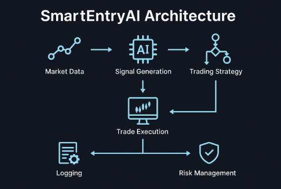

# SmartEntryAI (Educational Version)

**SmartEntryAI** is an automated trading Expert Advisor (EA) for MetaTrader 5, designed for research and demonstration purposes.  
It showcases **signal detection, automated trade execution, and risk management**.

⚠️ **Disclaimer**:  
This EA is currently **not profitable** and is provided for **educational and demonstration purposes only**.  
Use at your own risk.

---

## Architecture

---

## Features
- **Smart Signal Logic:** Entry conditions based on multiple indicators.
- **Risk Management:** Configurable lot size and stop-loss/take-profit settings.
- **Automated Trade Execution:** Fully automated order placement and management.
- **Backtest Ready:** Optimized for MetaTrader Strategy Tester.

---

## Repo Structure
SmartEntryAI/
├── LICENSE # MIT License
├── README.md # Project documentation
├── .gitignore # Ignore compiled & unnecessary files
├── src/ # EA source code
│ ├── SmartEntryAI.mq5
│ ├── modules/
│ │ ├── risk_manager.mqh
│ │ ├── signal_logic.mqh
│ │ └── trade_executor.mqh
├── docs/ # Screenshots or architecture diagrams
│ └── architecture.png
├── backtests/ # Backtest results
│ └── backtest_report.html

---

## Getting Started
### 1. Copy Files
Place the `src/SmartEntryAI.mq5` and any modules in:

### 2. Compile
- Open `SmartEntryAI.mq5` in **MetaEditor**.
- Click **Compile**.

### 3. Test or Demo Trade
- Attach the EA to a chart or run it in **Strategy Tester**.

---

## Future Improvements
- Improve profitability with better signal filtering.
- Add adaptive risk management.
- Integrate AI-based market prediction.

---

## Backtest Results
You can find historical performance data in the [`backtests/`](backtests/) folder.

---

## License
This project is licensed under the MIT License – see [LICENSE](LICENSE).

---

## Author
**Hamza Abajtour**  
- [GitHub](https://github.com/Rob0y)  
- [LinkedIn](https://www.linkedin.com/in/hamza-abajtour-a8b18225b/)  
- [X (Twitter)](https://x.com/AbajtourHamza)

